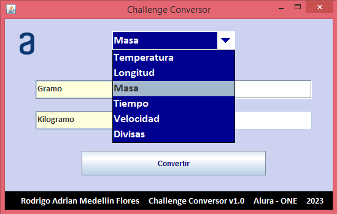
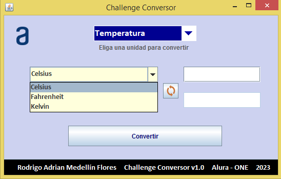
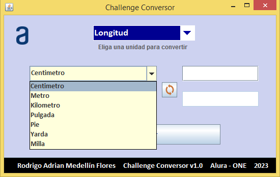
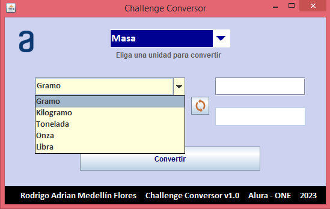
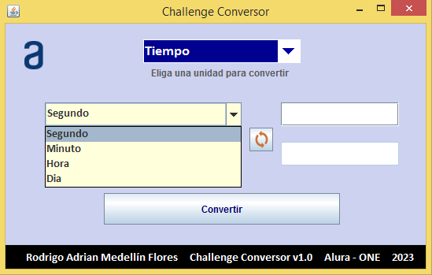
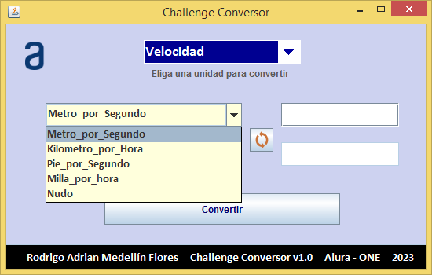
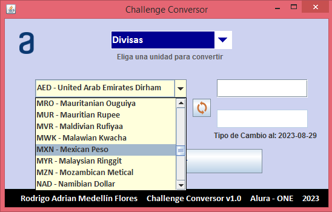
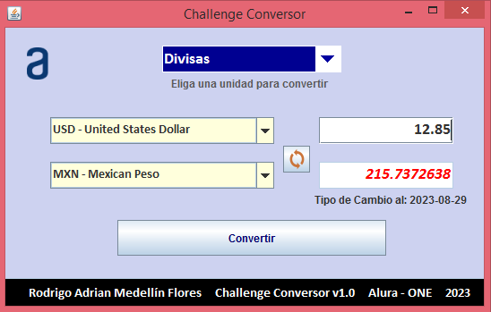

# Challenge Conversor

Aplicación de Escritorio que consiste en un Conversor de Unidades y Divisas desarrollado para el Curso ONE - Alura Grupo 5.

En esta aplicación podemos realizar conversiones entre 24 unidades distintas y hasta 170 divisas con el tipo de cambio actualizado.

## Funciones y Caracteristicas

- `Interfaz Intuitiva`: Interfaz sencilla e intuitiva para un fácil manejo de la aplicación.

 
 La interfaz consta de 3 listas(1 con el tipo de unidad a convertir, las otras 2 listas contienen las unidades a convertir), 2 botones(1 para realizar la conversion, otro para intercambiar las unidades a convertir) y 2 campos de texto(1 para introducir la cantidad a convertir, otro para mostrar el resultado de la conversión).

- `Lista con tipo de Conversion`: Podemos escoger entre 6 tipos de unidades para convertir

- `Unidades de Temperatura`: Podemos escoger entre 3 tipos de unidades de temperatura para convertir

- `Unidades de Longitud`: Podemos escoger entre 7 tipos de unidades de longitud para convertir

- `Unidades de Masa`: Podemos escoger entre 5 tipos de unidades de masa para convertir

- `Unidades de Tiempo`: Podemos escoger entre 4 tipos de unidades de tiempo para convertir

- `Unidades de Velocidad`: Podemos escoger entre 5 tipos de unidades de velocidad para convertir

- `Divisas`: Podemos escoger entre 170 monedas distintas para convertir

 El tipo de cambio actualizado se obtiene usando la API Fixer.io

- `Otras caracteristicas`:
    - El campo para ingresar la cantidad solo permite caracteres númericos y el punto decimal.
    - El resultado se muestra en color rojo y con letra más grande.
    - Al terminar de digitar la cantidad a convertir podemos usar la tecla Enter como opción al botón "Convertir".
    - La aplicación cuenta con un boton que nos permite intercambiar las unidades que están selecionadas al momento.
    - El cálculo de la conversión se actualiza en tiempo real al momento de cambiar una de las unidades.

## Acceso a la aplicación

En este repositorio se pone a disposición el archivo "Conversor.jar", que es un ejecutable de la aplicación.

Para usar el proyecto se necesita descargar el fichero "Conversor.jar", una vez que la descarga ha finalizado, podemos ir a la carpeta de descargas de nuestro ordenador y ejecutar la aplicación con uno de los siguientes métodos:
- Con un doble click
- Con la opción "Abrir" del menú contextual del archivo (el menú contextual se despliega al hacer click derecho sobre el archivo)
- Seleccionando el archivo y presionando la tecla 'Enter'

### Requisitos

Java SE 8

## Técnologias Usadas

- Lenguaje Java (JDK 1.8.0_241)
- IDE VSCode (Extension Pack for Java v0.25.13)
- API Fixer.io

## Autor

Proyecto desarrollado con fines educativos por: Rodrigo Adrian Medellín Flores.

Curso ONE Grupo 5 - Alura Latam.

